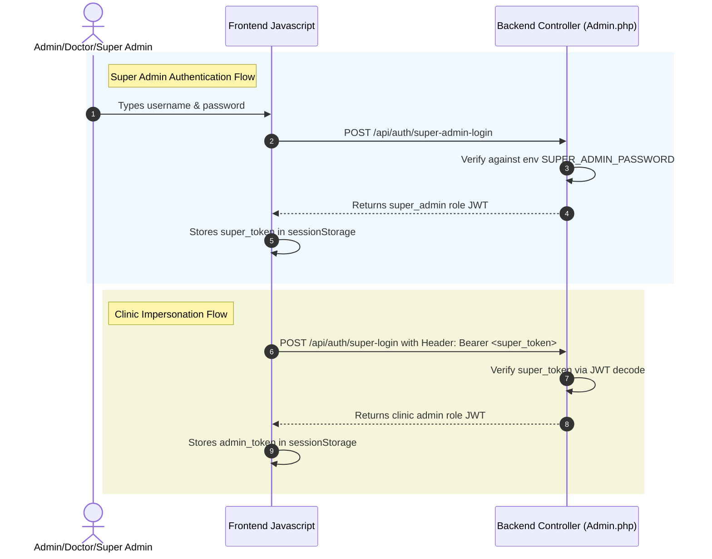

# Authentication & Authorization Architecture

This document explains the authentication, authorization, impersonation, and package plan gating implementation across the dental clinic portal.

---

## 1. Actor Roles & Permissions

The system defines four distinct roles:

| Role | clinicId Value | Token Location | Allowed Actions |
|---|---|---|---|
| **Super Admin** | `0` | `sessionStorage.super_token` | Register clinics, view/configure all clinics, impersonate any clinic. |
| **Clinic Admin** | DB Clinic ID | `sessionStorage / localStorage.admin_token` | Manage appointments, settings, custom themes, leads, reports. |
| **Doctor** | DB Clinic ID | `sessionStorage.admin_token` | Manage appointments, view patients, view follow-ups. |
| **Patient / Guest** | N/A | None | Public website page, book appointment, lookup own appointments. |

---

## 2. Authentication Flows



### A. Super Admin Verification
1. **Login Request**: User inputs credentials in the admin interface.
2. **API Call**: Frontend sends a `POST` request containing `{ username, password }` to `/api/auth/super-admin-login`.
3. **Backend Validation**:
   - The password is compared against the `SUPER_ADMIN_PASSWORD` variable defined in the server `.env` file.
   - The username is validated against `SUPER_ADMIN_USERNAMES` (comma-separated env list, defaulting to `superadmin,bunty`).
4. **Token Generation**: If valid, the backend returns a signed JWT token containing:
   ```json
   {
     "clinicId": 0,
     "username": "superadmin",
     "role": "super_admin",
     "exp": 1783062375
   }
   ```
5. **Session Storage**: The frontend saves the token under `sessionStorage.super_token`.

### B. Super Admin Clinic Impersonation
1. **Picker Selection**: When the super admin selects a clinic from the picker, the frontend requests impersonation.
2. **API Call**: Frontend invokes `POST /api/auth/super-login` sending `{ username: clinic_slug }` with `Authorization: Bearer <super_token>` header.
3. **Backend Validation**: The backend decodes the token, verifies that the role claim is `super_admin`, and logs the impersonation event for audit trails.
4. **Token Generation**: The backend returns a signed JWT token matching the target clinic's identity containing:
   ```json
   {
     "clinicId": 12,
     "username": "clinic_003",
     "role": "admin",
     "exp": 1783062375
   }
   ```
5. **Storage Setup**: The frontend stores this token in `sessionStorage.admin_token`, allowing the super admin to view the clinic's dashboard.

### C. Clinic Admin Login
1. **API Call**: Clinic admins post credentials to `/api/auth/login`.
2. **Validation**: Verified against database hashes (`clinics.admin_password_hash`).
3. **Token**: Generates a standard clinic JWT containing `role: 'admin'`, stored on the frontend inside `localStorage` (if "Remember Me" is checked) or `sessionStorage`.

---

## 3. Authorization & Gating Architecture

Authorization uses a centralized, prioritized feature-based system.

### Backend Feature Verification
Defined inside [MY_Controller.php](file:///c:/xampp/htdocs/dental-website-backend/application/core/MY_Controller.php), the `_isFeatureAllowed($feature)` helper determines permission status:
1. **Super Admin Exception**: Users authenticated as `super_admin` are permitted access to all features.
2. **DB Override Priority**: Individual overrides mapped inside the clinic's database column `visibility_settings` (e.g. `admin_show_reports => true`) override the package default settings.
3. **Package Default**: Fallback to the package default configuration mapped inside the `$packages` configuration array.

```php
// Enforced inside controller endpoints using MY_Controller
$this->authenticate();
$this->requireRole('admin');
$this->_requireFeature('reports'); // Blocks execution if reports not allowed
```

### Frontend Gating & Fail Closed
* Matching `PACKAGE_FEATURES` maps in [admin.js](file:///c:/xampp/htdocs/dental-website-frontend/js/admin.js) and [app.js](file:///c:/xampp/htdocs/dental-website-frontend/js/app.js) hide/show tabs, navigation bars, and widgets.
* Fallbacks fail closed, defaulting to **Package 1** (Basic Website Only) if configuration resolution fails.

---

## 4. Key Protections & Defense

* **Document Sandboxing**: Gated the `/api/documents/view` endpoint under authentication and role restrictions. Checks that `(int)$this->clinicId === (int)$clinicId` to isolate documents and prevent cross-clinic access.
* **Brute-Force OTP Throttling**:
  - `forgot_password`: Restricts to 3 requests per 10 minutes per IP/username combo.
  - `reset_password`: Throttles verification to 5 failed attempts per 10 minutes.
